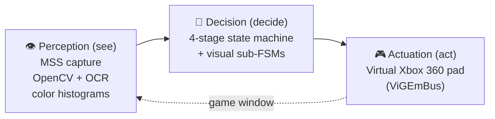
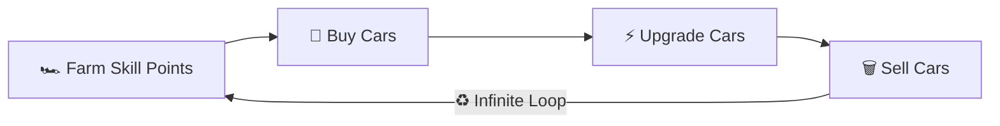

# 🏎️ FH6 AutoBot

**🌐 Language: English | [中文](README_zh-CN.md)**

> **An autonomous bot that plays Forza Horizon 6 with zero human input.** It *sees* the game
> through **computer vision** (OpenCV + Tesseract OCR) and *plays* it through a **virtual Xbox 360
> controller** (ViGEmBus), looping **farm → buy → upgrade → sell** forever — and you drive the whole
> thing from a **real-time web dashboard**, even from your phone.

[](https://github.com/hypoxic127/FH6-AFK/actions/workflows/ci.yml)
[](https://github.com/hypoxic127/FH6-AFK/actions/workflows/release.yml)
[](https://github.com/hypoxic127/FH6-AFK/releases/latest)


[](https://github.com/hypoxic127/FH6-AFK/stargazers)

---

## 🎬 Preview

<p align="center">
  
  <br><sub><em>Farming skill points, buying, upgrading, and selling cars — hands-free.</em></sub>
</p>

<p align="center">
  
  <br><sub><em>Web dashboard: live stage tracking, loop & super-wheelspin counters, log stream, and a QR code for phone monitoring.</em></sub>
</p>

---

## 🏛️ How It Works

FH6 AutoBot is a closed perception → decision → actuation loop. Every tick it captures the game
window, decides what state the game is in, and issues controller input — no human in the loop.



The codebase is **four layers with a strict one-way dependency direction**
(`web → macro / farm → engine`, never the reverse), so perception never depends on the UI:

| Layer | Responsibility |
|:------|:---------------|
| **`engine/`** | Perception + infrastructure — OCR, hybrid state detection, screen capture, gamepad, i18n, auto-updater |
| **`macro/`** | The automation — the master state machine plus per-stage menu macros (navigate / purchase / garage / upgrade) |
| **`farm/`** | A self-contained visual sub-state-machine that auto-drives an EventLab race to completion |
| **`web/`** | Flask + SocketIO server and the vanilla-JS dashboard |

**Notable engineering:**

- **12-pass OCR voting** — every skill-point read runs 3 preprocessing variants × 4 Tesseract PSM modes and votes on the result, so a single bad frame can't derail it.
- **Histogram + OCR hybrid state detection** — fast color-distribution screening narrows the candidates, then OCR confirms — cheap *and* robust across 10+ similar menus.
- **Self-healing capture** — on a BitBlt/GDI failure it resets the MSS instance and re-foregrounds the game window instead of feeding on black frames.
- **Cooperative-first safe stop** — halts on a clean boundary (gamepad released, never mid-keypress); async exception injection is only a fallback when a native call is blocking.

---

## ✨ Features

| Feature | Description |
|:--------|:------------|
| 🔁 **4-Stage Auto Loop** | Farm → Buy → Upgrade → Sell, infinite loop — sleep while it farms |
| 🖥️ **Web Dashboard** | Glassmorphism UI + real-time logs + QR-code mobile monitoring |
| ⏹️ **Safe Instant Stop** | Stops the bot instantly **and** cleanly — gamepad released, never mid-keypress |
| 🔄 **Auto-Update** | One-click update from the Web UI or `--update`, multi-mirror download |
| 🎰 **Super-Wheelspin Counter** | Automatically tracks upgrade-macro executions |
| 📦 **One-Click Build** | PyInstaller single-file `.exe`, no Python required |

---

## 🔄 Workflow



| Stage | State Constant | Description |
|:-----:|:---------------|:------------|
| 1️⃣ | `STATE_FARM_POINTS` | OCR scans skill points → auto-enters EventLab to farm up to 999 |
| 2️⃣ | `STATE_BUY_CARS` | Five-step visual navigation → batch-purchase 33 Subaru Impreza 22B-STIs |
| 3️⃣ | `STATE_UPGRADE_CARS` | Select each car with a NEW tag → spend skill points on the skill tree |
| 4️⃣ | `STATE_TRASH_CARS` | Batch-remove upgraded Imprezas (keeping the S2 main car) |

---

## 🛠️ Tech Stack

| Category | Technology |
|:---------|:-----------|
| **Vision** | OpenCV · Tesseract OCR · NumPy |
| **Capture & Input** | MSS · VGamepad + ViGEmBus |
| **Web** | Flask + Flask-SocketIO · Vanilla JS + CSS3 |
| **Tooling** | Pytest + Ruff · PyInstaller · GitHub Actions |

---

## 🚀 Getting Started

### 📋 Prerequisites

| Software | Version | Download | Notes |
|:---------|:--------|:---------|:------|
| **Python** | 3.10+ | [python.org](https://www.python.org/downloads/) | Check "Add to PATH" during install |
| **Tesseract OCR** | 5.x | [Download](https://github.com/UB-Mannheim/tesseract/releases) | Install to default location (auto-detected) |
| **ViGEmBus** | Latest | [Download](https://github.com/nefarius/ViGEmBus/releases) | **Reboot required** after install |

### 📥 Installation

```bash
git clone https://github.com/hypoxic127/FH6-AFK.git
cd FH6-AFK
python setup.py          # creates a venv + installs dependencies
python main_bot.py --web # launch the Web UI
```

### 🎮 In-Game Preparation

1. **Set the game language to English** — OCR depends on English text
2. **Windowed / Borderless mode** — any **16:9** resolution works (the skill-points OCR region is tuned for 16:9). On a non-16:9 monitor or non-default HUD scale, use the Web UI **Calibrate** button to box the skill-points number and save your own ROI
3. **Buy the main car** — `1998 Subaru Impreza 22B-STI Version` and **install an S2 tune** (PI badge = blue)
4. **Favorite an EventLab blueprint** — any works; the default share code `890169683` yields ~10 skill points per race
5. **Set Points / Match + Target Points** in the Web UI to match your blueprint (wrong values over- or under-farm)
6. **Enable Auto-Steering** (`Settings → Difficulty → Auto-Steering: ON`) — the bot relies on it to drive in EventLab

> **⚠️ The S2 blue PI badge on the main car is the *only* thing the bot uses to tell "keep" from "deletable" cars** — make sure your main car has an S2 tune applied.

---

## 📖 Usage

### 🌐 Web UI (recommended)

```bash
python main_bot.py --web              # default port 6800
python main_bot.py --web --port 8080  # custom port
```

Open `http://localhost:6800` for live status, the stage selector, a syntax-highlighted log
terminal, and a QR code to monitor from your phone.

```bash
FH6AutoBot.exe --update             # update to the latest release
FH6AutoBot.exe --skip-update --web  # skip the update check (e.g. autostart)
```

### 💻 Terminal mode

```bash
python main_bot.py
```

| Option | Function | When to Use |
|:------:|:---------|:------------|
| `[0]` | 🔄 Auto loop (full cycle) | Full 4-stage infinite loop |
| `[1]` | 🏎️ Farm Skill Points | Enter EventLab |
| `[2]` | 🛒 Buy Cars | Batch purchase Imprezas |
| `[3]` | ⚡ Upgrade Cars | Spend skill points |
| `[4]` | 🗑️ Sell Cars | In garage, Subaru brand selected |
| `[5]` | ⏭️ Skip Buy loop | When the garage already has un-upgraded cars |

### 📦 Build the executable

```bash
python packaging/build.py   # → dist/FH6AutoBot.exe (Tesseract & ViGEmBus still required)
```

---

## 🗺️ Roadmap

> Indicative direction, not a promise — ideas and PRs welcome.

- [ ] Resolution-agnostic skill-points ROI auto-detection (drop the 16:9 assumption)
- [ ] Built-in EventLab blueprint presets with per-blueprint points-per-match
- [ ] Richer dashboard analytics (points/hour, cars processed, session history)
- [ ] Multi-monitor capture selection in the Web UI
- [ ] Localization beyond en/zh

---

## 🤝 Contributing

Contributions are welcome — see [CONTRIBUTING.md](CONTRIBUTING.md).

---

## ⚠️ Disclaimer

FH6 AutoBot is provided for **educational and personal use only**. Automating gameplay may
violate the game's Terms of Service and could result in penalties or an account ban — **use it
at your own risk**. This is an independent, fan-made tool, **not affiliated with, endorsed by,
or associated with the developers or publisher** of any game it interacts with. The authors
accept no liability for any consequences of its use.

---

## 📝 License

For **learning and personal use** only — see [LICENSE](LICENSE).

---

## ⭐ Star History

[](https://star-history.com/#hypoxic127/FH6-AFK&Date)

---

**If this project helps you, please give it a ⭐ Star — it genuinely helps others discover it.**

Made with ❤️ by [hypoxic127](https://github.com/hypoxic127)
