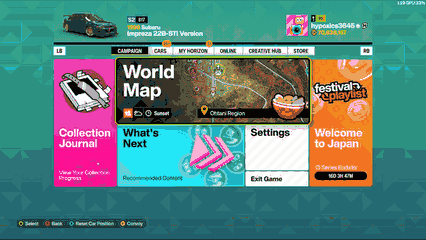
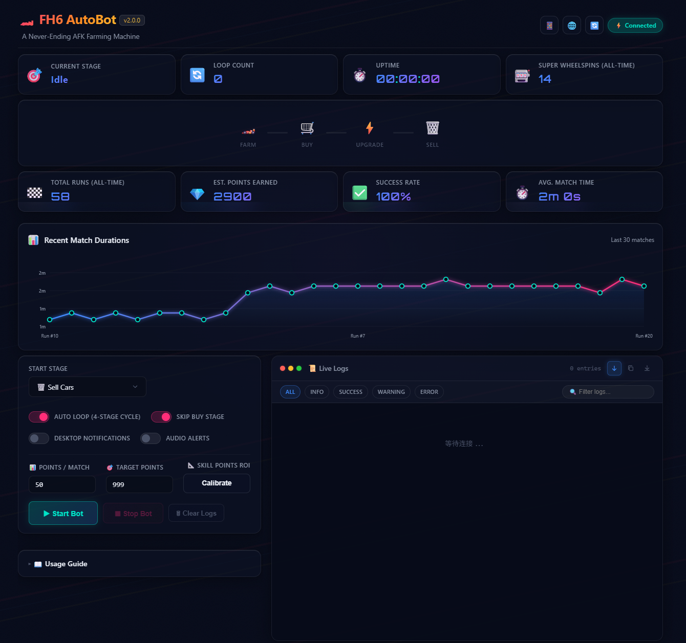
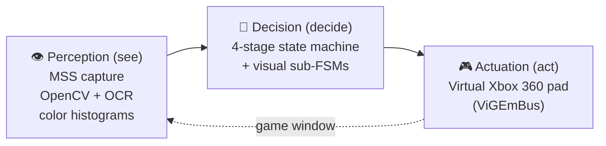
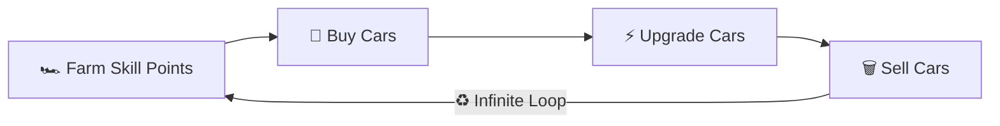

# 🏎️ FH6 AutoBot

**🌐 Language: English | [中文](README_zh-CN.md)**

> **An autonomous bot that plays Forza Horizon 6 with zero human input.**
> It *perceives* the game through **computer vision** (OpenCV + Tesseract OCR + color
> histograms) and *acts* through a **virtual Xbox 360 controller** (ViGEmBus) — closing a
> self-driving **farm → buy → upgrade → sell** loop that runs forever. Monitor and control it
> from a **real-time web dashboard**, even from your phone.

[](https://github.com/hypoxic127/FH6-AFK/actions/workflows/ci.yml)
[](https://github.com/hypoxic127/FH6-AFK/actions/workflows/release.yml)
[](https://github.com/hypoxic127/FH6-AFK/releases/latest)


[](https://github.com/hypoxic127/FH6-AFK/stargazers)

---

## 🎬 Demo

<p align="center">
  
</p>

<p align="center"><sub><em>The bot farming skill points, buying, upgrading, and selling cars — hands-free.</em></sub></p>

---

## 📸 Dashboard

<p align="center">
  
</p>

> Live stage tracking, loop & super-wheelspin counters, a syntax-highlighted log stream, and a QR
> code for phone monitoring — all served locally at `http://localhost:6800`.

---

## 🏛️ How It Works

FH6 AutoBot is a closed perception → decision → actuation loop. Every tick, it captures the game
window, decides what state the game is in, and issues controller input — no human in the loop.



The codebase is organized as **four layers with a strict one-way dependency direction**
(`web → macro / farm → engine`, never the reverse), so perception never depends on the UI:

| Layer | Responsibility |
|:------|:---------------|
| **`engine/`** | Perception + infrastructure — OCR, hybrid state detection, screen capture, gamepad, logging, i18n, auto-updater |
| **`macro/`** | The automation — the master state machine plus per-stage menu macros (navigate / purchase / garage / upgrade) |
| **`farm/`** | A self-contained visual sub-state-machine that auto-drives an EventLab race to completion |
| **`web/`** | Flask + SocketIO server and the vanilla-JS dashboard |

A thread-safe **event bus** decouples the bot from the UI entirely: engine/macro code *emits*
events (`log`, `state_change`, `bot_started`, …) and never imports `web`; the server subscribes and
forwards them to the browser over WebSocket.

---

## ⭐ Why This Is Interesting

A few engineering details that make this more than a click-recorder:

- **12-pass OCR voting** — every skill-point read runs 3 preprocessing variants × 4 Tesseract PSM
  modes and votes on the most frequent longest-digit result, so a single bad frame can't derail it.
- **Histogram + OCR hybrid state detection** — fast color-distribution screening narrows the
  candidate states, then OCR confirms — cheap *and* robust against 10+ visually similar menus.
- **Self-healing screen capture** — when a BitBlt/GDI capture fails, the bot resets the MSS instance
  and pulls the game window back to the foreground instead of silently feeding on black frames.
- **Cooperative-first safe stop** — a shared flag is checked at safe points so the bot always halts
  on a clean boundary (gamepad released, never mid-keypress); async exception injection is a
  fallback used only when a native call (e.g. a Tesseract subprocess) is blocking.
- **Transactional auto-updater** — integer-tuple version comparison, multi-mirror download with a
  rollback-on-failure file swap, and a restart guard that filters `--update` from `argv`.

<details>
<summary>📖 <strong>Full technical breakdown</strong></summary>

### 👁️ Visual State Detection

- **Histogram + OCR Hybrid** — `StateDetector` uses color distribution features for fast candidate screening, then OCR for precise verification
- **PI Badge Color Detection** — HSV color space analysis: blue = S2 main car (keep), orange = deletable

### 🔤 OCR Strategy

- **12-Pass Voting** — 3 preprocessing variants (Otsu / adaptive / fixed threshold) × 4 PSM modes (6/7/8/13) = 12 reads, votes on the most frequent longest-digit result
- **Otsu + 4× Upscale** — Binarization, white padding, and 4× linear upscale maximize small-digit accuracy
- **Zero Skill Points Fallback** — Unrestricted OCR detects the "No Skill Points Available" screen
- **Startup Pre-Flight** — Tesseract availability is verified at launch; missing OCR exits cleanly instead of looping

### 🎯 Garage Grid Navigation

- **Typewriter Traversal** — Column by column, top to bottom (3×N grid)
- **Triple Verification** — OCR keywords (2/3 match) + NEW yellow tag + LEGENDARY orange rarity
- **Cannot Afford Detection** — Auto-dismisses popup, stops purchasing

### 🛡️ Self-Healing Screenshot

- **BitBlt Failure Recovery** — Auto-resets MSS instance when GDI device context is corrupted
- **Window Re-Foreground** — Pulls game window back to front after capture failure
- **Graceful Stop** — Stopping releases the gamepad and resets MSS; capture errors during teardown are silenced (no false `ERROR` log spam)

### ⏹️ Stop Mechanism

- **Cooperative-First** — A shared stop flag is checked at safe points (before every button press, interruptible waits, each state-machine tick), so the bot stops at a clean boundary — never mid-keypress with a button left held
- **Injection Fallback** — Async exception injection is used only when the worker is blocked inside a native call (e.g. Tesseract subprocess); the Web UI replies instantly and a background task handles the grace-join + fallback
- **`BaseException`-based Signal** — The stop exception subclasses `BaseException`, so broad `except Exception` handlers can't accidentally swallow a stop request

</details>

---

## 📋 Table of Contents

- [🎬 Demo](#-demo)
- [📸 Dashboard](#-dashboard)
- [🏛️ How It Works](#️-how-it-works)
- [⭐ Why This Is Interesting](#-why-this-is-interesting)
- [✨ Features](#-features)
- [🔄 Workflow](#-workflow)
- [🛠️ Tech Stack](#️-tech-stack)
- [🚀 Getting Started](#-getting-started)
- [📖 Usage](#-usage)
- [📁 Project Structure](#-project-structure)
- [🗺️ Roadmap](#️-roadmap)
- [🧪 Testing & CI](#-testing--ci)
- [🤝 Contributing](#-contributing)
- [⚠️ Disclaimer](#️-disclaimer)
- [📝 License](#-license)

---

## ✨ Features

| Feature | Description |
|:--------|:------------|
| 🔁 **4-Stage Auto Loop** | Farm → Buy → Upgrade → Sell, infinite loop — sleep while it farms |
| 👁️ **Computer-Vision State Machine** | Color histogram + OCR hybrid detection across 10+ game UI states |
| 🎮 **Virtual Gamepad** | ViGEmBus emulates an Xbox 360 controller for native-level input |
| 🖥️ **Web Dashboard** | Glassmorphism UI + real-time logs + QR-code mobile monitoring |
| ⏹️ **Safe Instant Stop** | Cooperative checkpoints stop the bot instantly **and** cleanly; async injection only as a fallback |
| 🔄 **Auto-Update** | GitHub Releases auto-update with multi-mirror download, one-click from the Web UI or `--update` |
| 🛡️ **Self-Healing Capture** | BitBlt failure auto-recovery with MSS reset + window re-foreground |
| ✅ **Startup Pre-Flight** | Verifies Tesseract is available before running — a clear exit instead of an infinite retry loop |
| 🎰 **Super-Wheelspin Counter** | Automatically tracks upgrade-macro executions |
| 📦 **One-Click Build** | PyInstaller single-file `.exe`, no Python required |
| 🧪 **170+ Test Cases** | Ruff linting + Pytest coverage on GitHub Actions CI |

---

## 🔄 Workflow



| Stage | State Constant | Description |
|:-----:|:---------------|:------------|
| 1️⃣ | `STATE_FARM_POINTS` | OCR scans skill points → auto-enters EventLab to farm up to 999 |
| 2️⃣ | `STATE_BUY_CARS` | Five-step visual navigation → batch-purchase 33 Subaru Impreza 22B-STIs |
| 3️⃣ | `STATE_UPGRADE_CARS` | Select each car with a NEW tag → spend skill points on the skill tree |
| 4️⃣ | `STATE_TRASH_CARS` | Batch-remove upgraded Imprezas (keeping the S2 main car) |

---

## 🛠️ Tech Stack

| Category | Technology | Purpose |
|:---------|:-----------|:--------|
| **Vision Engine** | OpenCV, Tesseract OCR | Image processing, text recognition, color detection |
| **Numerics** | NumPy | Histogram comparison, image matrix operations |
| **Screen Capture** | MSS | High-performance cross-platform screenshots |
| **Gamepad** | VGamepad + ViGEmBus | Virtual Xbox 360 controller input |
| **Web Server** | Flask + Flask-SocketIO | Real-time Web UI control panel |
| **Frontend** | Vanilla JS + CSS3 | Glassmorphism dashboard, WebSocket live logs |
| **Testing** | Pytest + Ruff | Unit testing + code quality checks |
| **Packaging** | PyInstaller | One-click single-file executable build |
| **CI/CD** | GitHub Actions | Automated testing + Release publishing |

---

## 🚀 Getting Started

### 📋 Prerequisites

> ⚠️ The following software must be installed before running

| Software | Version | Download | Notes |
|:---------|:--------|:---------|:------|
| **Python** | 3.10+ | [python.org](https://www.python.org/downloads/) | Check "Add to PATH" during install |
| **Tesseract OCR** | 5.x | [Download](https://github.com/UB-Mannheim/tesseract/releases) | Install to default location (auto-detected) |
| **ViGEmBus** | Latest | [Download](https://github.com/nefarius/ViGEmBus/releases) | **Reboot required** after install |

### 📥 Installation

```bash
# 1. Clone the repository
git clone https://github.com/hypoxic127/FH6-AFK.git
cd FH6-AFK

# 2. One-click install (auto-creates venv + installs dependencies)
python setup.py

# 3. Launch (Web UI mode)
python main_bot.py --web
```

### 🎮 In-Game Preparation

Before starting the bot, ensure the following:

1. **Game language must be set to English** — OCR depends on English text
2. **Windowed mode** — Windowed or Borderless Windowed (recommended: 2560×1440). Any **16:9** resolution works (including the default 1600×900) — the skill-points OCR region is tuned proportionally for 16:9. On a **non-16:9 monitor** or with a **non-default HUD scale**, if skill points are misread, use the Web UI **Calibrate** button to box the skill-points number and save your own ROI
3. **Purchase main car** — `1998 Subaru Impreza 22B-STI Version`
4. **Install S2 tune** — Any S2-class tune (PI badge = blue)
5. **Favorite an EventLab blueprint** — Any blueprint works. The default share code `890169683` yields ~10 skill points per race
6. **Configure points per match** — In the Web UI, set **Points / Match** and **Target Points** to match your chosen blueprint. Incorrect values will cause the bot to over-farm or under-farm
7. **Enable Auto-Steering** — Go to `Settings → Difficulty → Auto-Steering: ON`. The bot relies on auto-steering for autonomous driving in EventLab

> **⚠️ Important:** The S2 **blue PI badge** on the main car is the sole indicator the program uses to distinguish "keep" vs "deletable" cars. Make sure your main car has an S2 tune applied.

---

## 📖 Usage

### 🌐 Web UI Mode (Recommended)

```bash
python main_bot.py --web              # Default port 6800
python main_bot.py --web --port 8080  # Custom port
```

Open `http://localhost:6800` in your browser to access the control panel:

- 🎯 **Live status & progress** — Current stage, loop count, runtime, super-wheelspin count, 4-stage progress bar
- ⚙️ **Stage selector** — Start from any stage via dropdown
- 📜 **Live log terminal** — Syntax-highlighted real-time log stream
- 📱 **Remote monitoring** — Scan the QR code to watch from your phone

### 🔄 Auto-Update

Checks GitHub Releases on startup; update in one click from the Web UI header, or via CLI:

```bash
FH6AutoBot.exe --update             # update now
FH6AutoBot.exe --skip-update --web  # skip the check (e.g. autostart)
```

### 💻 Terminal Mode

```bash
python main_bot.py
```

| Option | Function | When to Use |
|:------:|:---------|:------------|
| `[0]` | 🔄 Auto loop (full cycle) | Main menu — full 4-stage infinite loop |
| `[1]` | 🏎️ Farm Skill Points | Main menu — enter EventLab |
| `[2]` | 🛒 Buy Cars | Main menu — batch purchase Imprezas |
| `[3]` | ⚡ Upgrade Cars | Main menu — spend skill points |
| `[4]` | 🗑️ Sell Cars | In garage, Subaru brand selected |
| `[5]` | ⏭️ Skip Buy loop | When garage already has un-upgraded cars |

### 📦 Build Executable

```bash
python packaging/build.py
```

Produces `dist/FH6AutoBot.exe` — portable, no Python needed (Tesseract & ViGEmBus still required).

> **💡 Tip:** Push a git tag (e.g. `git tag v1.2.0 && git push --tags`) to auto-trigger the GitHub Actions build and publish to the Releases page.

---

## 📁 Project Structure

<details>
<summary>Click to expand the full source tree</summary>

```
FH6_AutoBot/
│
├── main_bot.py                 # 🚀 Entry point (Terminal / Web UI)
│
├── engine/                     # 🧠 Perception Engine
│   ├── ocr.py                  #    Computer vision (OCR + color detection)
│   ├── state_detect.py         #    Game state detector (histogram + OCR hybrid)
│   ├── event_bus.py            #    Event bus (log/state push to Web UI)
│   ├── runtime.py              #    PyInstaller runtime path resolution
│   ├── version.py              #    Single source of truth for app version
│   ├── updater.py              #    GitHub Releases auto-update engine
│   ├── i18n.py                 #    Bilingual string table (en/zh)
│   └── utils.py                #    Logging / window ops / gamepad / MSS capture
│
├── macro/                      # 🎮 Macro Operations
│   ├── master_loop.py          #    Master state machine (4-stage loop engine)
│   ├── core.py                 #    Infrastructure: screenshots, logging, constants
│   ├── navigation.py           #    Menu navigation / visual braking / return-to-garage
│   ├── purchase.py             #    5-step Impreza purchase navigation
│   ├── garage.py               #    Garage grid: select / delete / main car nav
│   └── upgrade.py              #    Upgrade macro (Cannot Afford detection)
│
├── farm/                       # 🏁 EventLab Farming
│   └── skills.py               #    Visual state machine (auto-drive + finish detection)
│
├── web/                        # 🌐 Web UI Control Panel
│   ├── server.py               #    Flask + SocketIO server
│   ├── state_manager.py        #    Global state manager
│   └── static/                 #    Frontend assets
│       ├── index.html          #      Dashboard page
│       ├── style.css           #      Cyberpunk theme styles
│       └── app.js              #      WebSocket client logic
│
├── packaging/                  # 📦 Build & Packaging
│   ├── build.py                #    One-click PyInstaller build script
│   ├── FH6AutoBot.spec         #    PyInstaller spec (--onefile)
│   └── hook_utf8.py            #    Runtime hook (Windows UTF-8 fix)
│
├── tests/                      # 🧪 Unit Tests (170+ cases)
├── tools/                      # 🔧 Dev utilities (not packaged)
│
├── .github/workflows/
│   ├── ci.yml                  #    CI (Ruff check + Pytest)
│   └── release.yml             #    Release (PyInstaller → GitHub Release)
│
├── setup.py                    # ⚙️ One-click environment setup
├── requirements.txt            # 📋 Python dependencies
├── ruff.toml                   # 🔍 Ruff linter config
└── pytest.ini                  # 🧪 Pytest config
```

</details>

---

## 🗺️ Roadmap

> Indicative direction, not a promise — ideas and PRs welcome.

- [ ] Resolution-agnostic skill-points ROI auto-detection (drop the 16:9 assumption)
- [ ] A library of built-in EventLab blueprint presets with per-blueprint points-per-match
- [ ] Richer dashboard analytics (points/hour, cars processed, session history)
- [ ] Multi-monitor capture selection in the Web UI
- [ ] Localization beyond en/zh

---

## 🧪 Testing & CI

```bash
# Run all tests
python -m pytest

# Lint check
python -m ruff check .

# Format check
python -m ruff format --check .
```

| CI Job | Trigger | Description |
|:-------|:--------|:------------|
| **Lint** | Push / PR | Ruff lint + format validation |
| **Test** | Push / PR | 170+ test cases (ubuntu-latest, hardware tests excluded) |
| **Release** | `v*` tag | PyInstaller build → GitHub Release (auto-sync version) |

---

## 🤝 Contributing

PRs welcome — fork → branch (`git checkout -b feat/...`) → commit → push → open a PR.

- 🐍 Code style **PEP 8**, enforced by Ruff
- 🏷️ Commits follow [Conventional Commits](https://www.conventionalcommits.org/) (`feat` / `fix` / `docs` / `refactor` / `chore`)
- ✅ All PRs must pass CI (Lint + Test)

---

## ⚠️ Disclaimer

FH6 AutoBot is provided for **educational and personal use only**. Automating gameplay may
violate the game's Terms of Service and could result in penalties or an account ban — **use it
at your own risk**. This is an independent, fan-made tool, **not affiliated with, endorsed by,
or associated with the developers or publisher** of any game it interacts with. The authors
accept no liability for any consequences of its use.

---

## 📝 License

For **learning and personal use** only — see [LICENSE](LICENSE).

---

## ⭐ Star History

[](https://star-history.com/#hypoxic127/FH6-AFK&Date)

---

**If this project helps you, please give it a ⭐ Star — it genuinely helps others discover it.**

Made with ❤️ by [hypoxic127](https://github.com/hypoxic127)
