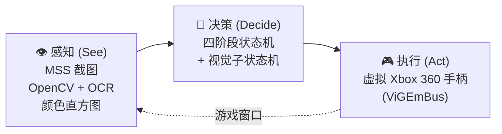
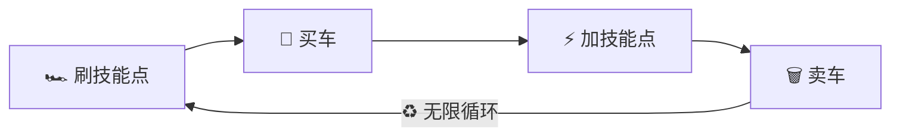

# 🏎️ FH6 AutoBot

**🌐 语言: [English](README.md) | 中文**

> **一个零人工干预、自主操控《极限竞速：地平线 6》的全自动机器人。** 它用 **计算机视觉**
> （OpenCV + Tesseract OCR）*看* 游戏，用 **虚拟 Xbox 360 手柄**（ViGEmBus）*玩* 游戏，
> 永不停歇地循环 **刷点 → 买车 → 加点 → 卖车** —— 你只需通过 **实时 Web 仪表盘** 监控操控，手机也行。

[](https://github.com/hypoxic127/FH6-AFK/actions/workflows/ci.yml)
[](https://github.com/hypoxic127/FH6-AFK/actions/workflows/release.yml)
[](https://github.com/hypoxic127/FH6-AFK/releases/latest)


[](https://github.com/hypoxic127/FH6-AFK/stargazers)

---

## 🎬 预览

<p align="center">
  
  <br><sub><em>无人值守地刷技能点、买车、加点、卖车。</em></sub>
</p>

<p align="center">
  
  <br><sub><em>Web 仪表盘：实时阶段追踪、循环与超级轮盘计数、日志流，以及手机监控二维码。</em></sub>
</p>

---

## 🏛️ 工作原理

FH6 AutoBot 是一条 感知 → 决策 → 执行 的闭环。每个循环周期都会捕获游戏窗口、判断当前状态、
下发手柄输入 —— 全程无需人工介入。



代码库按 **四层架构 + 严格的单向依赖** 组织（`web → macro / farm → engine`，绝不反向），
确保感知层永不依赖 UI：

| 层级 | 职责 |
|:-----|:-----|
| **`engine/`** | 感知 + 基础设施 —— OCR、混合状态检测、屏幕捕获、手柄、i18n、自动更新 |
| **`macro/`** | 自动化逻辑 —— 主状态机 + 各阶段菜单宏（导航 / 购买 / 车库 / 升级） |
| **`farm/`** | 自包含的视觉子状态机，自动驾驶 EventLab 比赛直至结算 |
| **`web/`** | Flask + SocketIO 服务端与原生 JS 仪表盘 |

**工程亮点：**

- **12 路 OCR 投票** —— 每次读取技能点跑 3 种预处理 × 4 种 Tesseract PSM 模式再投票，单个坏帧无法干扰结果。
- **直方图 + OCR 混合状态检测** —— 先用颜色分布快速筛选候选，再用 OCR 精确确认，在 10+ 个相近菜单间既省算力又稳健。
- **截图自愈** —— BitBlt/GDI 截图失败时重置 MSS 实例、把游戏窗口拉回前台，而不是在黑帧上空跑。
- **协作式优先的安全停止** —— 总在干净的边界停下（释放手柄、绝不卡在按键中途）；异步异常注入仅在原生调用阻塞时兜底。

---

## ✨ 核心特性

| 特性 | 描述 |
|:-----|:-----|
| 🔁 **全自动四阶段循环** | 刷点 → 买车 → 加点 → 卖车，无限循环 —— 睡觉时也在刷 |
| 🖥️ **Web 仪表盘** | 毛玻璃风格界面 + 实时日志 + 手机扫码远程监控 |
| ⏹️ **安全即时停止** | 让 Bot **立即且干净地**停止 —— 释放手柄、绝不卡在按键中途 |
| 🔄 **自动更新** | Web UI 一键更新或 `--update`，多镜像下载 |
| 🎰 **超级轮盘计数** | 自动统计已执行的加点宏次数 |
| 📦 **一键打包** | PyInstaller 单文件 `.exe`，无需 Python 环境 |

---

## 🔄 工作流程



| 阶段 | 状态常量 | 说明 |
|:----:|:---------|:-----|
| 1️⃣ | `STATE_FARM_POINTS` | OCR 扫描技能点 → 自动进入 EventLab 刷满 999 |
| 2️⃣ | `STATE_BUY_CARS` | 五步视觉导航 → 批量购买 33 辆 Subaru Impreza 22B-STI |
| 3️⃣ | `STATE_UPGRADE_CARS` | 逐辆选择 NEW 标签车辆 → 消耗技能点升级技能树 |
| 4️⃣ | `STATE_TRASH_CARS` | 批量移除已升级 Impreza（保留 S2 主力车） |

---

## 🛠️ 技术栈

| 类别 | 技术 |
|:-----|:-----|
| **视觉** | OpenCV · Tesseract OCR · NumPy |
| **捕获与输入** | MSS · VGamepad + ViGEmBus |
| **Web** | Flask + Flask-SocketIO · Vanilla JS + CSS3 |
| **工具链** | Pytest + Ruff · PyInstaller · GitHub Actions |

---

## 🚀 快速开始

### 📋 前置要求

| 软件 | 版本 | 下载 | 备注 |
|:-----|:-----|:-----|:-----|
| **Python** | 3.10+ | [python.org](https://www.python.org/downloads/) | 安装时勾选 "Add to PATH" |
| **Tesseract OCR** | 5.x | [下载链接](https://github.com/UB-Mannheim/tesseract/releases) | 默认路径安装即可（程序自动检测） |
| **ViGEmBus** | 最新版 | [下载链接](https://github.com/nefarius/ViGEmBus/releases) | 安装后需 **重启电脑** |

### 📥 安装步骤

```bash
git clone https://github.com/hypoxic127/FH6-AFK.git
cd FH6-AFK
python setup.py          # 创建虚拟环境 + 安装依赖
python main_bot.py --web # 启动 Web UI
```

### 🎮 游戏内准备

1. **游戏语言设为英文** —— OCR 识别依赖英文文本
2. **窗口化 / 无边框模式** —— 任意 **16:9** 分辨率均可（技能点 OCR 取词区按 16:9 调校）。若用非 16:9 显示器或非默认 HUD 缩放，点击 Web UI 的 **Calibrate** 按钮框选技能点数字、保存为你自己的 ROI
3. **购买主力车** —— `1998 Subaru Impreza 22B-STI Version`，并 **安装 S2 级调校**（PI 徽章显示蓝色）
4. **收藏 EventLab 蓝图** —— 任意蓝图均可；默认分享码 `890169683` 每局约 10 技能点
5. 在 Web UI 中设置 **单局点数** 和 **目标点数** 以匹配你的蓝图（填错会多跑或少跑）
6. **开启自动转向**（`设置 → 难度设置 → 自动转向：开启`）—— Bot 在 EventLab 中依赖它自动驾驶

> **⚠️ 主力车的 S2 蓝色 PI 徽章是 Bot 区分「保留车」与「可删除车」的*唯一*判据** —— 务必确认主力车已安装 S2 调校。

---

## 📖 使用指南

### 🌐 Web UI（推荐）

```bash
python main_bot.py --web              # 默认端口 6800
python main_bot.py --web --port 8080  # 自定义端口
```

浏览器访问 `http://localhost:6800`，即可看到实时状态、起始阶段选择、带语法高亮的日志终端，
以及手机监控用的二维码。

```bash
FH6AutoBot.exe --update             # 更新到最新版本
FH6AutoBot.exe --skip-update --web  # 跳过更新检查（如开机自启）
```

### 💻 终端模式

```bash
python main_bot.py
```

| 选项 | 功能 | 使用场景 |
|:----:|:-----|:---------|
| `[0]` | 🔄 自动循环（全流程） | 完整四阶段无限循环 |
| `[1]` | 🏎️ 刷技能点 | 进入 EventLab 跑图 |
| `[2]` | 🛒 买车 | 批量购买 Impreza |
| `[3]` | ⚡ 加技能点 | 消耗技能点升级 |
| `[4]` | 🗑️ 卖车 | 车库内，需选中斯巴鲁品牌 |
| `[5]` | ⏭️ 跳过买车循环 | 车库已有未加点的车时使用 |

### 📦 打包为 EXE

```bash
python packaging/build.py   # → dist/FH6AutoBot.exe（仍需 Tesseract 和 ViGEmBus）
```

---

## 🗺️ 路线图

> 仅为方向性规划，并非承诺 —— 欢迎提出想法与 PR。

- [ ] **可配置目标车型** —— 不止写死的 Impreza 22B-STI，刷任意车型
- [ ] **分辨率无关 OCR** —— 自动检测技能点 ROI，摆脱 16:9 假设
- [ ] **蓝图预设** —— 内置 EventLab 蓝图，每个自带单局点数
- [ ] **仪表盘分析** —— 点数/小时、已处理车辆数、会话历史
- [ ] **多显示器** —— Web UI 中选择捕获的显示器
- [ ] **更多语言** —— 中英之外的本地化

---

## 🤝 贡献指南

欢迎贡献 —— 详见 [CONTRIBUTING.md](CONTRIBUTING.md)。

---

## ⚠️ 免责声明

FH6 AutoBot 仅供**学习与个人使用**。自动化游戏可能违反游戏的服务条款（ToS），并可能导致处罚或封号
——**使用风险自负**。本项目为独立的非官方爱好者工具，**与所操作游戏的开发商或发行商无任何关联，
也未获其授权或认可**。作者对使用本工具产生的任何后果不承担责任。

---

## 📝 许可证

仅供 **学习与个人使用** —— 详见 [LICENSE](LICENSE)。

---

## ⭐ Star 趋势

[](https://star-history.com/#hypoxic127/FH6-AFK&Date)

---

**如果这个项目对你有帮助，请给一个 ⭐ Star —— 这能实实在在地帮助更多人发现它。**

Made with ❤️ by [hypoxic127](https://github.com/hypoxic127)
